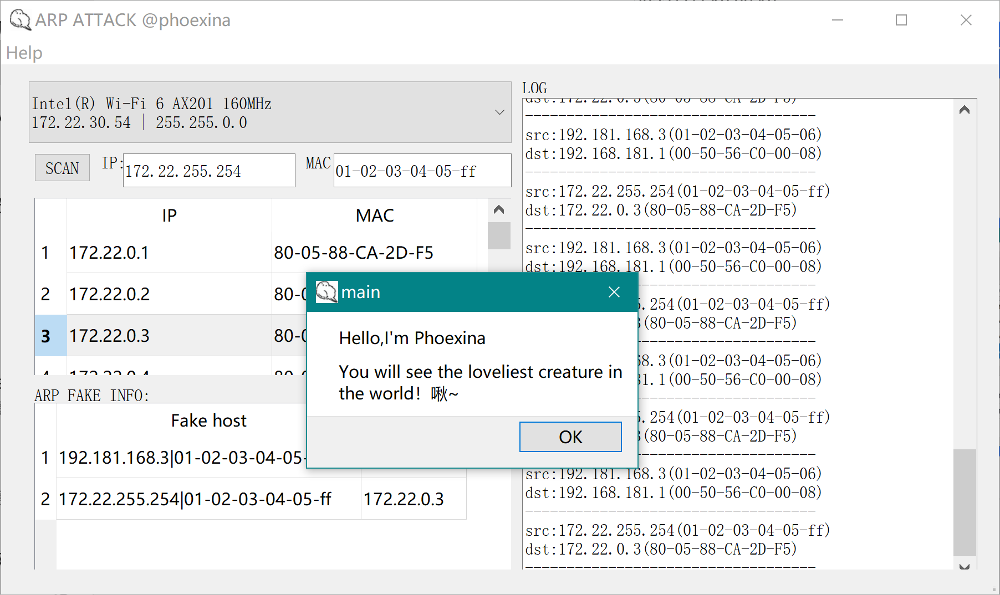

# Win-ARPAttack
这是一个在windows下实现的有界面的ARP攻击软件,是一份普普通通的大作业，发上来试试github怎么上传0v0 
让我从这里开始写一份美观的说明文档吧~

### 环境 
* Windows(显然) 
* QT5(C++) 
    需要配亿点点库和头文件，因为使用了不完全的winpcap。不得不配但又不完全配，可能这就是不愿意连乱七八糟外部库的我最后的倔强x 
    ws2_32.lib：不会有人这个都不自带吧 
    iphlpapi.lib：我当时是自己带的，室友的是我把我的拷过去的 
    packet.lib：~~配置很长，先换一行~~ 
    >1. 首先需要下winpcap 
    >2. 然后把/Lib/x64里的这个文件拷贝到QT默认导入的文件夹里（你以为这个文件夹一定在QT的文件夹里吗？不，它可以不在:) 
    >3. 总之，选中你可以导入的include文件，通过跳转查询到文件本体，然后打开它的目录文件夹，这就是include的文件夹，lib文件夹一定在附近自己找吧! 
    >4. 当你把这个文件拷进去后，QT就默认认识它们了，别忘了把对应的.h文件也放进去（我当时是把整个winpcap的include文件下的东西都放进去了，注意文件夹也要原装的直接拷进去） 
    >5. 这个时候你会发现，震惊，packet还需要.a文件。而我翻遍那个默认目录找不到任何其他.a文件的存在，于是我不得不在项目文件夹下做了一个lib文件夹专门放它 
    >6. 聪明的你一定发现了，岂不是所有的都可以这么配！这样代码一克隆，啥都不用配直接就能跑。理论上可行，实际上好像include的有点问题（显然为了看起来简洁统一，强迫症的我试了试）不管如何反正我这样跑通了，就不管啦~ 
    >7. 一个忠告：如果你一直配不通，建议换个代码抄（真的会有人看吗）
### 开始   
* 显然放进QT里运行就可以开始，不会有人不知道打开pro文件吧 
  